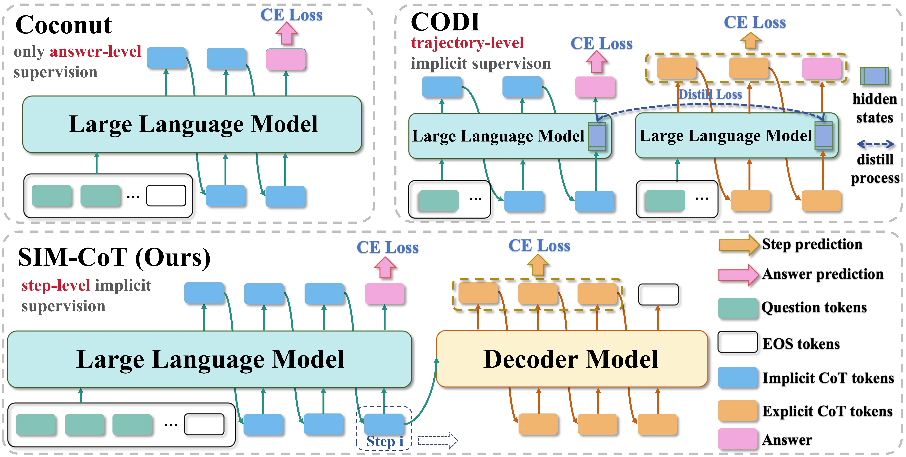

<!-- <p align="center" width="100%">

</p> -->

<div align="center">
    <h1 align="center"> SIM-CoT: Supervised Implicit Chain-of-Thought
    </h1>
</div>

<p align="center">
  
</p>


- **Authors**: [Xilin Wei](https://github.com/Wiselnn570), [Xiaoran Liu](https://scholar.google.de/citations?user=Qe6F4J4AAAAJ&hl=en), [Yuhang Zang](https://yuhangzang.github.io), [Xiaoyi Dong](https://lightdxy.github.io), [Yuhang Cao](https://scholar.google.com/citations?user=sJkqsqkAAAAJ&hl=en), [Jiaqi Wang](https://myownskyw7.github.io/), [Xipeng Qiu](https://xpqiu.github.io/en.html), [Dahua Lin](http://dahua.site/)
- **Institutes**: Fudan University; Shanghai AI Laboratory; The Chinese University of Hong Kong; Shanghai Innovation Institute; 
- **Resources**: [📖[Paper](https://arxiv.org/pdf/2509.20317)] [[🏠Project Page]()] [[🤗Huggingface](https://huggingface.co/collections/Wiselnn/sim-cot-supervised-implicit-chain-of-thought-68d895b00576f6166c19ab4f)]
## 💡 Highlights

- 🔥 **Latent Instability in Implicit CoT:** We systematically analyze the limitations of implicit Chain-of-Thought methods and reveal a **latent instability issue**—as the number of implicit tokens increases, models tend to collapse into homogeneous latent states that lose operator semantics.  

- 🔥 **Step-Level Supervision with SIM-CoT:** We propose **S**upervised **IM**plicit-CoT (**SIM-CoT**), a plug-and-play module that introduces **step-level supervision** via an auxiliary decoder. This stabilizes optimization, prevents collapse, and ensures that latent tokens capture meaningful reasoning steps.

- 🔥 **Strong and Consistent Performance:** SIM-CoT consistently outperforms both explicit and implicit baselines. On GPT-2, it exceeds supervised CoT by **+2.1%**, Coconut by **+8.2%**, and CODI by **+4.3%**. Across larger LLaMA models (1B/3B/8B), it delivers **+1.5% to +9.0%** gains, and remains stable even with **8–16 implicit tokens**, where prior methods collapse.  

- 🔥 **Efficiency and Interpretability:** SIM-CoT adds **no extra inference cost** since the auxiliary decoder is discarded after training. It also provides **interpretability**, allowing each latent token to be decoded into a human-readable reasoning step.  

## 📜 News

**[2025/9/24]** [Code]() and [Paper](https://arxiv.org/pdf/2509.20317) are released!

## 👨‍💻 Todo

- [x] Code Release
- [x] Checkpoint Release
- [x] Usage Instructions Release


## 🛠️ Usage

### 1. Clone the repository
```bash
git clone https://github.com/InternLM/SIM-CoT.git
cd SIM-CoT
```

### 2. Install dependencies
```bash
pip install -r requirements.txt
```

---

### 3. Training with Coconut + SIM-CoT

#### Step 1: Train the Coconut baseline
```bash
cd Coconut
torchrun --nnodes 1 --nproc_per_node 8 run.py args/gsm_coconut.yaml
```

#### Step 2: Continue training with SIM-CoT
Select a checkpoint that has been expanded to predefined implicit tokens, then continue training with SIM-CoT:
```bash
torchrun --nnodes 1 --nproc_per_node 8 run.py args/gsm_simcot.yaml
```

---

### 4. Evaluation with Coconut + SIM-CoT
```bash
torchrun --nnodes 1 --nproc_per_node 8 run.py args/gsm_simcot_eval.yaml
```

---

### 5. Training with CODI + SIM-CoT
```bash
cd CODI
bash scripts/train_llama3b_gsm8k-aug-decoder-2.sh
```

---

### 6. Evaluation with CODI + SIM-CoT
```bash
bash CODI/scripts/test_llama3b-copy.sh
```


## ✒️ Citation

If you find our work helpful for your research, please consider giving a star ⭐ and citation 📝

```bibtex
@article{wei2025simcot,
  title={{SIM-COT}: Supervised Implicit Chain-of-Thought},
  author={Wei, Xilin and Liu, Xiaoran and Zang, Yuhang and Dong, Xiaoyi and Cao, Yuhang and Wang, Jiaqi and Qiu, Xipeng and Lin, Dahua},
  journal={arXiv preprint arXiv:2509.20317},
  year={2025}
}
```

## ❤️ Acknowledgments

- [Coconut](https://github.com/facebookresearch/coconut): The codebase we built upon. Thanks for their wonderful work.
- [CODI](https://github.com/zhenyi4/codi): Our work is based on this codebase; we are grateful for their valuable contribution.
- [LLaMA series](https://huggingface.co/meta-llama/collections): The amazing open-sourced large language model!
- [GPT2](https://huggingface.co/openai-community/gpt2): An impressive open-source large language model!
